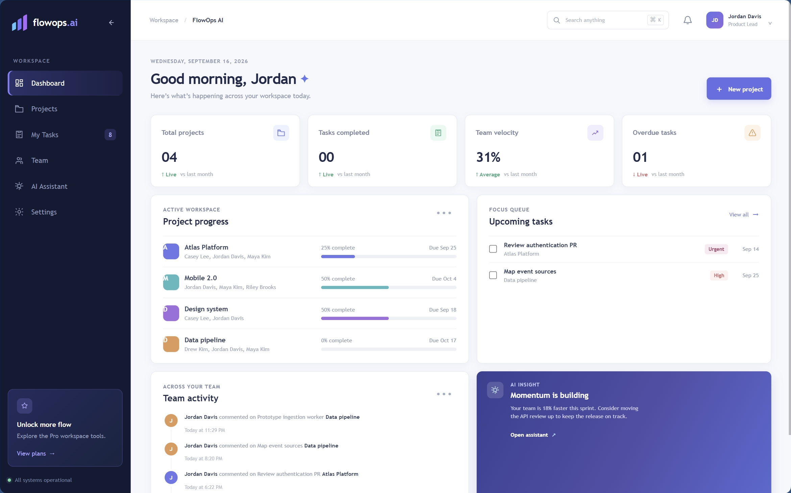
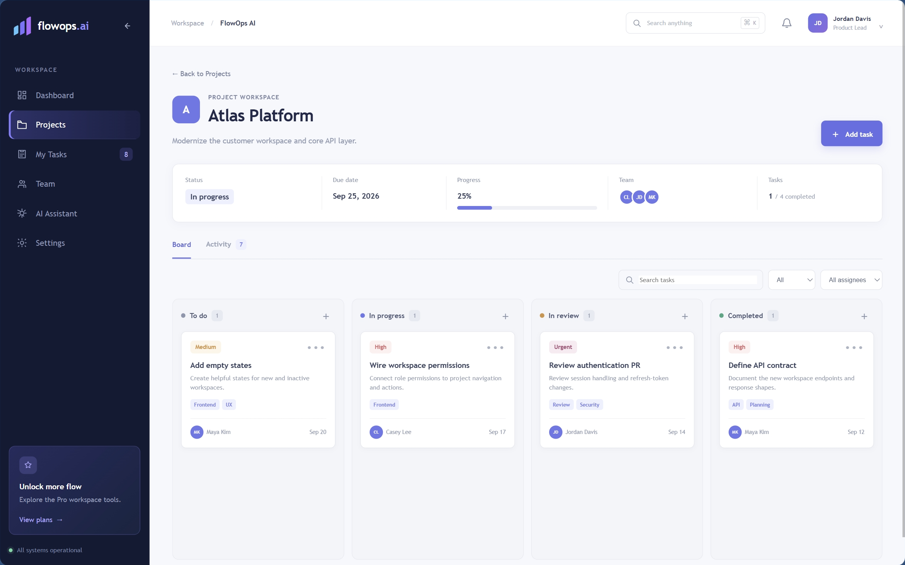
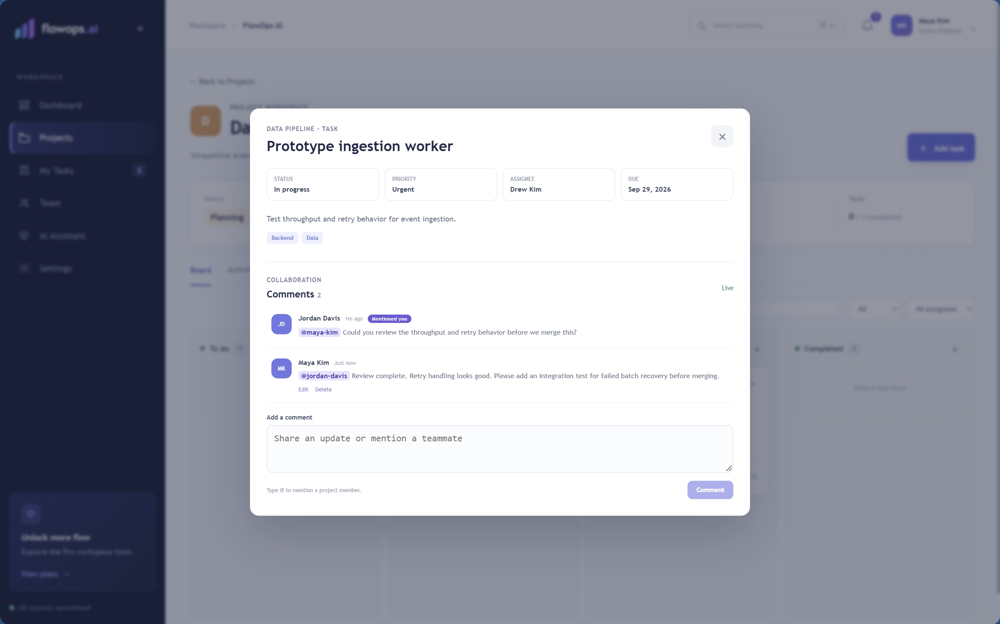
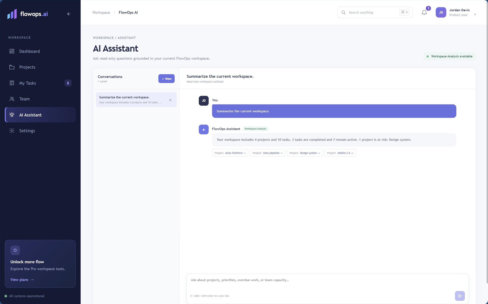
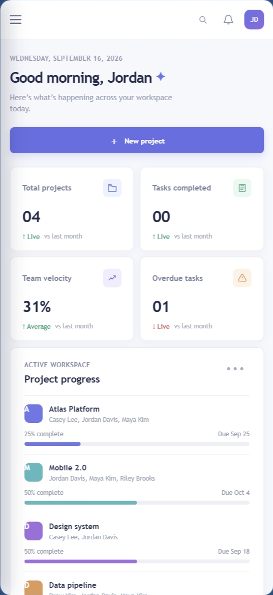

# FlowOps AI

FlowOps AI is a full-stack collaborative project workspace designed and built by **Endrina Berbatovci**. It brings project planning, task delivery, real-time discussion, notifications, workload visibility, and grounded workspace insight into one responsive product.

The application is more than a visual prototype: an Angular client reads and mutates an ASP.NET Core API, PostgreSQL persists operational data, SignalR distributes collaboration events, and Docker Compose coordinates the runtime services.

> “Selected implementation excerpts are included for technical review. The complete source code is maintained privately and is available to recruiters upon request.”

## My engineering contribution

I designed and implemented FlowOps AI across the product and delivery stack. My work includes:

- structuring a responsive Angular 22 application with lazy-loaded routes and standalone components;
- building typed TypeScript services that map API contracts into signal-based client state;
- implementing projects, task workflows, Kanban movement, comments, mentions, notifications, deep links, and persisted user settings;
- integrating authenticated SignalR collaboration with reconnect state and task-room rejoin behavior;
- connecting the client to an ASP.NET Core 10 API backed by EF Core 10 and PostgreSQL 17;
- applying cookie-session, CSRF, membership-authorization, validation, and protected-state boundaries;
- separating deterministic Workspace Analysis from an optional backend-only external AI provider;
- testing frontend behavior with Angular TestBed, Vitest, and HTTP mocks, and backend behavior with xUnit, WebApplicationFactory, and Testcontainers PostgreSQL;
- packaging the system with Nginx, Docker, health checks, persistent volumes, and CI validation.

## Verified technology stack

| Layer | Technology |
| --- | --- |
| Client | Angular 22, TypeScript 6, Angular CDK, RxJS 7.8, Angular signals and reactive forms |
| API | ASP.NET Core 10, C#, REST controllers, SignalR 10, Problem Details |
| Identity and security | ASP.NET Core Identity, HttpOnly cookie sessions, antiforgery/CSRF validation, member-scoped authorization |
| Persistence | PostgreSQL 17, Entity Framework Core 10, Npgsql, non-destructive migrations |
| Delivery | Docker Compose, multi-stage Docker builds, Nginx, health checks, GitHub Actions |
| Testing | Vitest, Angular TestBed, HttpTestingController, xUnit, WebApplicationFactory, Testcontainers PostgreSQL |

## Product evidence

### Workspace dashboard

The responsive dashboard combines project progress, upcoming work, team activity, and workload signals without hiding the underlying operational state.

### Project and Kanban workflow

Projects connect scoped membership, progress, activity history, and tasks. The Kanban surface supports task creation and movement between workflow states; status changes persist through the API.

### Real-time task collaboration

Task discussions support persisted comments, validated member mentions, author-controlled edits and deletion, notification deep links, and SignalR updates. The Angular client exposes connecting, connected, reconnecting, and unavailable states and rejoins the active task room after reconnecting.

### Workspace Analysis

Workspace Analysis is the dependable assistant mode. It deterministically summarizes only workspace data the current user can access. An optional external AI provider can be configured behind the API, but it is not required for the product to function and is not presented here as production AI availability.

### Responsive product experience

Desktop and mobile layouts share the same API-backed state and workflows; the mobile interface is not a separate mock.

## Angular and TypeScript engineering

### Typed signal state

Shared services own typed writable signals and expose read-only views or computed state to components. API response types are mapped into UI models at a single boundary. Pending-request sets prevent duplicate loads, while immutable upserts keep project and comment collections predictable.

### SignalR collaboration lifecycle

The task-comment service builds an authenticated SignalR connection with automatic reconnect intervals. It registers typed create, update, delete, and notification events, tracks connection state, and rejoins the active task room after the transport reconnects.

### Session and CSRF boundary

Authentication is owned by the server through an HttpOnly Identity cookie. Angular sends credentials only to the configured API boundary. Mutating API requests receive an antiforgery header from the readable CSRF cookie. A protected `401` clears client-side protected state and redirects to login with a validated local return URL.

## Testing strategy

The repository currently contains 87 frontend and 35 backend test declarations.

- Frontend tests cover signal-backed services, HTTP behavior, authentication and CSRF interception, forms, guards, responsive interaction, collaboration events, notifications, deep-link restoration, and assistant behavior.
- Backend integration tests exercise real middleware, Identity sessions, antiforgery, authorization, EF Core persistence, comments, mentions, notifications, and assistant behavior against an isolated PostgreSQL container.
- GitHub Actions runs frontend tests and builds, backend restore/build/test, and Docker Compose configuration validation.

The focused excerpts in [`samples/`](samples/README.md) show representative engineering decisions without publishing the complete implementation. A concise system view is available in [`docs/ARCHITECTURE.md`](docs/ARCHITECTURE.md).

## Honest limitations

- This is a portfolio application, not a publicly hosted multi-tenant SaaS.
- No public live deployment is claimed.
- Same-column custom Kanban ordering is session-only; task status changes persist.
- The deterministic Workspace Analysis mode is always available, while external AI is optional and deployment-configured.
- Email delivery, password recovery, MFA, billing, file storage, organization tenancy, external identity providers, audit export, and direct messaging are not implemented.
- A public production deployment would still require TLS termination, managed secrets, production origin/proxy configuration, backups, monitoring, and an approved account lifecycle.

## Technical review

Selected implementation excerpts are included for technical review. The complete source code is maintained privately and is available to recruiters upon request.

Copyright © 2026 Endrina Berbatovci. All rights reserved.

This showcase is provided for portfolio and technical review purposes. No permission is granted to copy, modify, redistribute, or use this work commercially.
