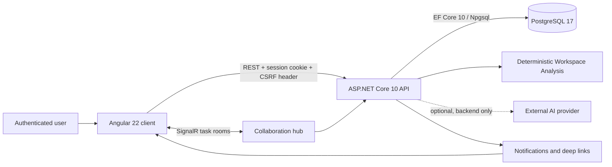

# FlowOps AI architecture

FlowOps AI separates presentation, authenticated application behavior, collaboration delivery, persistence, and optional assistant infrastructure. Angular owns client presentation and transient state; ASP.NET Core owns authorization and business operations; PostgreSQL remains the system of record.

## Authentication and authorization

ASP.NET Core Identity owns the authenticated session through an HttpOnly, SameSite cookie. Angular bootstraps session state from the API and includes credentials only for API requests. State-changing requests include an antiforgery header derived from the CSRF cookie.

The API resolves the current domain user and enforces authenticated fallback policy, project membership, task access, author-only comment mutation, and mention membership. SignalR task-room joins pass through the same authenticated membership boundary.

## State ownership

- **Angular services** own transient UI state through typed signals, computed values, immutable collection updates, loading state, and bounded error messages.
- **ASP.NET Core** owns validation, authorization, project/task operations, comment and mention rules, notification creation, and assistant orchestration.
- **PostgreSQL** owns durable users, projects, memberships, tasks, activities, settings, comments, mentions, notifications, and assistant conversations.
- **SignalR** delivers events after durable mutations have committed; it is not the source of truth.

## Request and event flow

1. Angular sends a typed request to the API with the server-managed session.
2. The API validates the DTO, current user, project membership, and operation-specific rules.
3. EF Core writes the durable change to PostgreSQL.
4. After commit, SignalR broadcasts the relevant comment or notification event.
5. Angular immutably upserts the event into signal state or refreshes persisted notifications.
6. After reconnecting, the client rejoins the active task room before returning to the connected state.

## Assistant boundary

Workspace Analysis is deterministic, read-only, and grounded in records accessible to the current user. An external AI provider is optional and isolated behind a backend interface. Provider credentials and grounded context remain server-side. Provider availability is deliberately not required for API readiness, and this showcase makes no claim that external AI is enabled in a public production environment.

## Delivery boundary

The production client image is built in stages and served by Nginx, which supplies SPA fallback and proxies API and WebSocket traffic. Docker Compose coordinates PostgreSQL, the API, and the frontend with health checks and named volumes. The checked-in Compose profile is a local portfolio/demo configuration; a public deployment still requires production TLS, secrets management, trusted origin/proxy configuration, backups, and monitoring.
